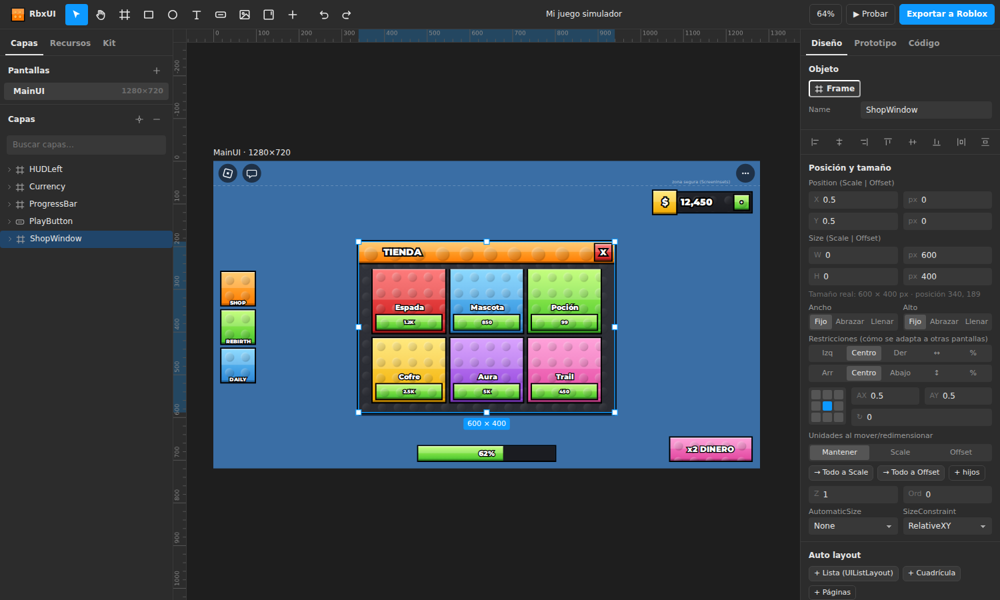

# RbxUI Studio

**Editor tipo Figma para crear interfaces de Roblox bonitas y exportarlas a Roblox Studio sin que nada se
descuadre.**

A diferencia de diseñar en Figma y "traducir" después, en RbxUI Studio **cada capa es una instancia real de
Roblox**: Frame, TextLabel, ImageLabel, ScrollingFrame… con sus modificadores (UICorner, UIStroke, UIGradient,
UIListLayout, UIPadding, UIShadow…). El editor dibuja todo con las reglas de Roblox (UDim2, AnchorPoint,
TextSize, layouts, barra superior), así que lo que ves es lo que tendrás en el juego.



## Qué puedes hacer

- Diseñar con herramientas de Figma: frames, texto, botones, imágenes, auto layout, restricciones,
  alineación, guías inteligentes, reglas, componentes, estilos de color/texto, copiar/pegar estilo, escala K…
- Usar **solo fuentes de Roblox** (las 40 familias oficiales; 32 incluidas para la vista previa).
- Probar las interacciones (abrir/cerrar ventanas con animación, efectos de botón, teclas, navegación) y
  exportarlas como un **LocalScript real**.
- Exportar a Roblox:
  - **`.rbxmx`**: clic derecho en StarterGui › *Insert from File…*
  - **Script Luau** para la *Command Bar* (crea la UI en StarterGui; se puede deshacer)
  - **ModuleScript** para crear la UI desde código
- **Importar** UIs existentes desde Studio (`.rbxmx`) para editarlas aquí.
- Kit "Stud Style" de simulador listo para usar (ventanas, botones, tarjetas, HUD, divisas, barras…).

Todas las funciones de Figma y su estado: [docs/FIGMA_PARITY.md](docs/FIGMA_PARITY.md).

## Empezar

Abre `index.html` servido por cualquier servidor estático, o:

```bash
node cli/rbxui.mjs serve      # http://localhost:5170
```

Publicación: el workflow `.github/workflows/pages.yml` la publica en GitHub Pages. Antes hay que activarlo una
vez en Settings › Pages › Source = "GitHub Actions".

## Para Claude y otros agentes

El formato del proyecto es un JSON legible con nombres de Roblox ([docs/FORMAT.md](docs/FORMAT.md)). La CLI permite
diseñar sin interfaz:

```bash
node cli/rbxui.mjs render mi-ui.json --out out/mi-ui.png   # ver el diseño como PNG
node cli/rbxui.mjs validate mi-ui.json                     # esquema + revisión de diseño + rbx-dom
node cli/rbxui.mjs export mi-ui.json --format rbxmx        # exportar para Studio
node cli/rbxui.mjs import MiUI.rbxmx                       # traer una UI de Studio
```

Guía de estilo y flujo de trabajo: [CLAUDE.md](CLAUDE.md).

**Servidor MCP**: Claude Desktop y Claude Code pueden usar RbxUI como herramienta (renderizar y ver el PNG, validar,
exportar, plantillas). Instalación: [docs/MCP.md](docs/MCP.md).

## Desarrollo

```bash
npm install       # solo Playwright (render headless y tests e2e)
npm test          # tests unitarios: layout, modelo, rich text, exportadores, round-trip rbxmx
npm run e2e       # el editor con ratón y teclado reales
```

Validación con herramientas reales de Roblox (opcional):

- `tools/rbxcheck`: `cargo build --release` y luego `rbxcheck archivo.rbxmx`. Usa **rbx-dom** (el mismo parser que
  Rojo) con la base de datos de reflexión de Roblox para validar cada propiedad.
- `lune run tests/luau-check.luau x.luau x.rbxmx`: ejecuta el Luau exportado en la emulación de Roblox de
  [Lune](https://lune-org.github.io/docs) y comprueba que crea las mismas instancias que el `.rbxmx`.

### Estructura

```
index.html            editor
app/js/core/          motor puro (Node + navegador): esquema de Roblox, modelo, layout, texto, render SVG, lint
app/js/editor/        interfaz: lienzo, capas, inspector, kit, componentes, estilos, prototipo
app/js/export/        .rbxmx, Luau, LocalScript de interacciones, importador .rbxmx
app/fonts/            fuentes OFL equivalentes a las de Roblox (+ métricas)
cli/                  rbxui.mjs (render/export/validate/import) y servidor
tools/                generadores (API de Roblox, fuentes) y validador rbxcheck (Rust)
tests/                unitarios, e2e, fixtures
docs/                 formato, paridad con Figma, verificación en Studio
```

## Licencias y créditos

- Tipos y valores por defecto de la API de Roblox: base de datos de reflexión de
  [rbx-dom](https://github.com/rojo-rbx/rbx-dom) (MIT).
- Fuentes: versiones OFL publicadas en [Fontsource](https://fontsource.org) (SIL Open Font License, incluida en
  cada carpeta de `app/fonts/`).
- La textura de studs se genera por código (arte propio). Los iconos Stud de terceros **no** se incluyen.
